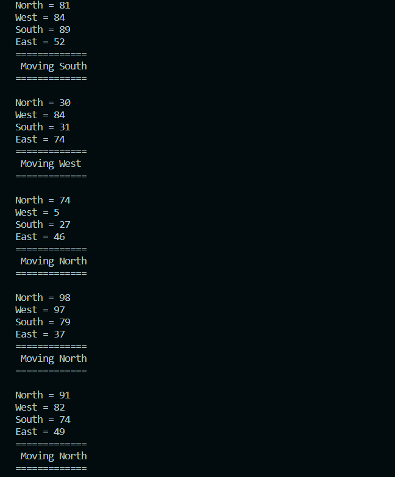

# Avoid
# Hangman

- **Description:** This C++ program simulates a robot's movement in an obstacle-filled environment. It generates random sensor readings, stores them in an array, and uses a simple algorithm to determine the robot's optimal movement direction based on the maximum sensor value.
- **How to Run:**
  1. Clone this repository to your local machine.
     ```bash
     git clone https://github.com/abdullahejazjanjua/Avoid.git
     ```
  2. Compile the C++ code using Visual Studio Code.
     - Open the project folder in VS Code.
     - Use the integrated terminal to run:
       ```bash
       g++ avoid.cpp -o avoid
       ```
  3. Run the game.
     ```bash
     ./avoid
     ```
  4. Follow the on-screen instructions to guess the word and enjoy playing Hangman!

## Screenshots

<p align="center">
  
</p>
<p align="center">
  The robot will move in the direction that has the largest value
</p>


## Technologies Used

Projects leverage a variety of technologies, including:
- Programming Languages: C++
- Development Environment: Visual Studio Code
- Tools: Git

## Acknowledgments

Gratitude to my instructors for guiding these projects, pivotal to my growth as a programmer.
Feel free to explore, provide feedback, or reach out. 
Thank you for visiting my Avoid Repository!
